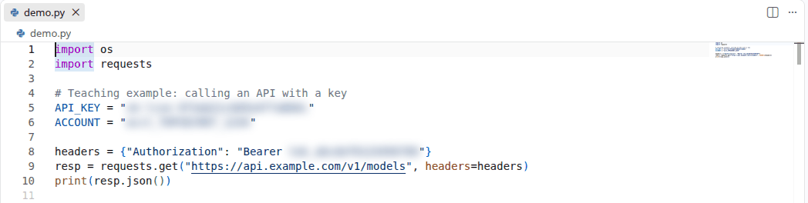
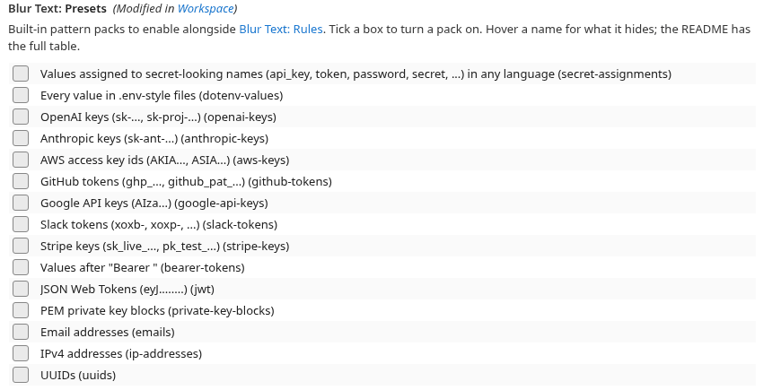
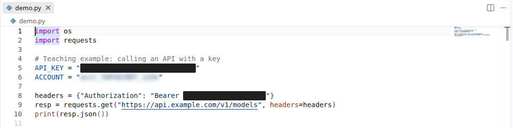

# Blur Text

Blur or black out any text that matches a pattern you specify — API keys, tokens,
student names, internal URLs — so you can share your screen, teach, or record a demo
without leaking it.



Works in **VS Code desktop** and **VS Code for the Web** (vscode.dev, github.dev,
Codespaces), because the whole extension runs in either extension host.


## Quick start

1. Install the extension.
2. Open your settings and add the text you want hidden:

   ```jsonc
   // settings.json
   "blurText.rules": [
     "sk-live-9f3ab21c0d5e4f7a8b6c"
   ]
   ```

3. That's it — every occurrence is blurred in every open editor.

Faster route: select the secret in the editor, right-click → **Blur Selected Text**.
It writes the rule to your **User** settings by default, so the secret does not end up
in a `.vscode/settings.json` that you might commit.

Toggle everything on and off with `Ctrl+Alt+B` (`Cmd+Alt+B` on macOS), or click the
status bar item.

## Patterns

Each entry in `blurText.rules` is either a plain string (matched literally) or an
object with more control.

### Literal text

```jsonc
"blurText.rules": [
  "hunter2",
  { "pattern": "acme corp", "caseSensitive": false },
  { "pattern": "key", "wholeWord": true }     // matches `key`, not `monkey`
]
```

Literal patterns are matched exactly — regex metacharacters are escaped for you, so
`"a.c"` matches only `a.c`, never `abc`. Matching is case sensitive unless you say
otherwise.

### Regular expressions

Set `"regex": true` and the pattern becomes a JavaScript regular expression:

```jsonc
{ "pattern": "sk-[A-Za-z0-9]{20,}", "regex": true }
```

### Blurring only part of a match

This is the useful one for teaching: keep the code readable, hide only the value.
Put the secret part in a capture group and point `group` at it.

```jsonc
// Shows `API_KEY = ` in the clear, blurs only what follows.
{ "pattern": "API_KEY\\s*=\\s*(\\S+)", "regex": true, "group": 1 }
```

`group` accepts:

| Value            | Meaning                                        |
| ---------------- | ---------------------------------------------- |
| `0` (default)    | the whole match                                |
| `1`, `2`, …      | that numbered capture group                    |
| `"value"`        | that **named** group — `(?<value>...)`          |
| `[1, 2, 3]`      | several groups at once                          |

A list is handy with alternations, where only one branch matches at a time:

```jsonc
// Hides the value whether it is double-quoted, single-quoted, or bare.
{
  "pattern": "=\\s*(?:\"([^\"]*)\"|'([^']*)'|(\\S+))",
  "regex": true,
  "group": [1, 2, 3]
}
```

Groups that did not participate in a match are simply skipped.

### Limiting where a rule applies

```jsonc
{
  "pattern": "\\d{3}-\\d{2}-\\d{4}",
  "regex": true,
  "languages": ["markdown", "plaintext"],   // language ids; omit for all
  "files": "**/students/**"                 // glob; omit for all
}
```

### All rule options

| Option          | Type                        | Default | Notes                                              |
| --------------- | --------------------------- | ------- | -------------------------------------------------- |
| `pattern`       | string                      | —       | Required. Literal text, or a regex if `regex`.      |
| `regex`         | boolean                     | `false` | Treat `pattern` as a JavaScript regular expression. |
| `flags`         | string                      | `""`    | Extra regex flags, e.g. `"m"`, `"s"`. `g` and `d` are always on. |
| `group`         | number \| string \| array   | `0`     | Which part of the match to hide.                    |
| `caseSensitive` | boolean                     | `true`  | Set `false` to ignore case.                         |
| `wholeWord`     | boolean                     | `false` | Word-boundary matching, literal patterns only.      |
| `languages`     | string[]                    | all     | Language ids this rule applies to.                  |
| `files`         | string (glob)               | all     | Glob this rule applies to.                          |
| `enabled`       | boolean                     | `true`  | Keep the rule but turn it off.                      |
| `style`         | `"blur"` \| `"redact"`      | global  | Per-rule override.                                  |
| `blurRadius`    | number                      | global  | Per-rule override.                                  |

## Presets

Instead of writing patterns yourself, switch on a built-in pack. Presets are **off by
default** — nothing is hidden until you ask for it.

In the Settings UI they are plain checkboxes:



Or in `settings.json`:

```jsonc
"blurText.presets": {
  "secret-assignments": true,
  "dotenv-values": true,
  "openai-keys": true
}
```

A plain array of ids — `["secret-assignments", "openai-keys"]` — is accepted too.

| Preset               | Hides                                                        |
| -------------------- | ------------------------------------------------------------ |
| `secret-assignments` | Values assigned to secret-looking names (`api_key`, `token`, `password`, …) in any language |
| `dotenv-values`      | Every value in `.env`-style files                             |
| `openai-keys`        | `sk-…`, `sk-proj-…`                                           |
| `anthropic-keys`     | `sk-ant-…`                                                    |
| `aws-keys`           | Access key ids (`AKIA…`, `ASIA…`)                             |
| `github-tokens`      | `ghp_…`, `github_pat_…`                                       |
| `google-api-keys`    | `AIza…`                                                       |
| `slack-tokens`       | `xoxb-…`, `xoxp-…`                                            |
| `stripe-keys`        | `sk_live_…`, `pk_test_…`                                      |
| `bearer-tokens`      | The token after `Bearer `                                     |
| `jwt`                | `eyJ….….…`                                                    |
| `private-key-blocks` | Whole PEM `BEGIN/END PRIVATE KEY` blocks                      |
| `emails`             | Email addresses                                               |
| `ip-addresses`       | IPv4 addresses                                                |
| `uuids`              | UUIDs                                                         |

`secret-assignments` hides the value, not the name, so `API_KEY = "…"` still reads as
`API_KEY = ` followed by a smudge.

## Settings

| Setting                      | Default              | What it does                                          |
| ---------------------------- | -------------------- | ----------------------------------------------------- |
| `blurText.enabled`           | `true`               | Master switch.                                        |
| `blurText.rules`             | `[]`                 | Your patterns.                                        |
| `blurText.presets`           | `[]`                 | Built-in pattern packs.                               |
| `blurText.style`             | `"blur"`             | `"blur"` smudges, `"redact"` covers with a solid block.|
| `blurText.blurRadius`        | `5`                  | Blur strength in pixels.                              |
| `blurText.revealAtCursor`    | `false`              | Un-blur a match while your cursor is inside it, so you can still edit it. Only applies to the focused editor. |
| `blurText.excludeLanguages`  | `["log", "search-result"]` | Languages never blurred.                        |
| `blurText.excludeConfigFiles`| `true`               | Never blur inside VS Code's own settings files.       |
| `blurText.excludeFiles`      | `[]`                 | Globs never blurred, e.g. `["**/fixtures/**"]`.       |
| `blurText.maxFileSize`       | `2000000`            | Skip documents larger than this many characters.      |
| `blurText.maxMatchesPerRule` | `5000`               | Stop after this many matches per rule per document.   |
| `blurText.debounceMs`        | `120`                | Delay after a keystroke before re-scanning. Pastes ignore this — see below. |
| `blurText.showStatusBarItem` | `true`               | Show the status bar indicator.                        |

`blurText.rules` and `blurText.presets` are resource-scoped, so a project can add its
own on top of yours.

The `redact` block color is themeable as `blurText.redactBackground`.

### Redacting instead of blurring

`"blurText.style": "redact"` paints a solid block instead of smudging. A blur can in
principle be reversed from a screenshot; a block cannot.



Styles mix — the screenshot above uses `redact` globally with one rule overridden to
`{ "style": "blur", "blurRadius": 4 }`.

### Pasting, and editing your own config

Two behaviours worth knowing about:

**Pastes are not debounced.** `blurText.debounceMs` keeps ordinary typing from
re-scanning the document on every keystroke, but a paste can put a whole secret on
screen in one go. Any edit that inserts more than one character — a paste, a
multi-cursor insert, an undo, a snippet — redecorates immediately instead of waiting
out the debounce, so raising `debounceMs` for performance never widens the window in
which a pasted secret is readable.

It still is not instant: decorations are applied after VS Code renders the edit, so
there is a one-frame flash that no extension can avoid. If you are pasting a live
secret in front of an audience, toggle blurring off, paste, and toggle back on.

**Your settings files are never blurred.** `blurText.rules` contains the very strings
being hidden, so blurring inside `settings.json` would smudge the patterns you are
trying to edit. User settings, `.vscode/settings.json` and `*.code-workspace` files are
skipped by default; set `blurText.excludeConfigFiles` to `false` if you want them
treated like any other file.

## Commands

| Command                             | Default key   | What it does                                       |
| ----------------------------------- | ------------- | -------------------------------------------------- |
| **Blur Text: Toggle Blurring**      | `Ctrl+Alt+B`  | Flips `blurText.enabled`.                          |
| **Blur Text: Peek**                 | `Ctrl+Alt+P`  | Reveals everything until you run it again. Session-only — it does not change your settings, so you cannot forget to turn blurring back on. |
| **Blur Text: Blur Selected Text**   | —             | Adds the selection as a literal rule. Also on the editor right-click menu. |
| **Blur Text: Enable / Disable**     | —             | For keybindings and tasks that need one direction.  |
| **Blur Text: Edit Patterns**        | —             | Jumps to the settings.                             |

## Important limitations

**This is a visual overlay, not redaction.** The characters are still in your file and
still in the DOM. Treat it as "don't show this on the projector", not as a security
control:

- **Copy, paste, and search still see the real text.** So does every other extension.
- **It only covers text editors.** The integrated terminal, output panels, the Problems
  view, hovers, IntelliSense previews, Peek windows, the Search results panel,
  breadcrumbs, and sticky scroll are **not** blurred.
- **The minimap is not blurred** — it is drawn on a canvas that CSS filters do not reach.
  At minimap scale text is not legible, but turn the minimap off if you want certainty.
- **A blur can be undone from a screenshot** in principle. For anything you truly must
  not leak, use `"style": "redact"`, which paints a solid block and destroys the pixels.
- **Nothing protects the file itself.** A secret in your repo is still committed, still
  in your shell history, still in `git log`. Rotate it.

If a rule's regex is invalid, the extension warns once and skips that rule — the rest
keep working. It never fails closed into "everything visible" silently.

## Development

```bash
npm install
npm run compile      # builds dist/extension.js (desktop) and dist/web/extension.js (web)
npm test             # unit tests for the matching logic
npm run check-types
```

Press <kbd>F5</kbd> and pick **Run Extension (Desktop)** or **Run Extension (Web)**.
To try the web build in a real browser:

```bash
npm run open-in-browser
```

The extension has no runtime dependencies and never imports a Node builtin, which is
what lets one codebase serve both the Node.js and Web Worker extension hosts.

## Publishing

```bash
npm run package    # -> blur-text-<version>.vsix
npm run publish    # vsce publish
```

The Marketplace publisher is `oney` (the `publisher` field); the code is hosted under
the `soney` GitHub org (the `repository` field). They are different on purpose — the
publisher id matches the existing `oney.*` extensions.

Before the first publish:

1. Create a personal access token at <https://dev.azure.com> with scope
   **Marketplace > Manage** and **Organization: All accessible organizations**. That
   last setting matters — a PAT restricted to a single organization is the usual reason
   `vsce publish` returns 401 even though the token is valid.
2. Mint that token while signed in as the Microsoft account that owns the `oney`
   publisher. A PAT from any other account fails with
   `Access Denied: <guid> ... on the resource /oney`, which is an authorization error,
   not a scope problem — the token authenticated fine, the identity just has no rights
   on that publisher. `npx vsce verify-pat oney` checks this in isolation, and
   `https://app.vssps.visualstudio.com/_apis/profile/profiles/me` (basic auth, empty
   user, PAT as password) reports which account a token belongs to.
3. `npx vsce login oney`, or skip it — see the note below.
4. **Push the repository first.** `vsce` rewrites relative image links in `README.md`
   to `https://github.com/soney/vscode-blur-text/raw/HEAD/images/…`, so the screenshots
   only load in the extension details panel once those files exist on the default
   branch. This is also why images look broken if you install the `.vsix` locally
   before pushing.

### Publishing from a headless or remote host

`vsce login` stores the token in the OS keyring. On a machine with no desktop session
— an SSH or VS Code Remote host, a container, CI — `gnome-keyring-daemon` is usually
not running and the keyring is locked, so the login fails at the very last step:

```
The Personal Access Token verification succeeded for the publisher 'oney'.
ERROR  Cannot create an item in a locked collection
```

That message means the token was accepted and only the *storage* failed. Skip the
keyring by passing the token through the environment instead:

```bash
read -rsp "PAT: " VSCE_PAT; export VSCE_PAT; echo
npm run publish
```

`vsce publish` reads `VSCE_PAT` (or takes `--pat <token>`), so no login is needed.
Using `read` rather than `export VSCE_PAT=…` keeps the token out of your shell history.

`vsce` refuses to publish extensions containing user-provided SVGs. This extension
satisfies every one of those checks:

| Constraint                                        | Here                                  |
| ------------------------------------------------- | ------------------------------------- |
| `icon` in `package.json` may not be an SVG         | `images/icon.png`, a 256×256 PNG      |
| Badges may not be SVGs (unless a trusted provider) | no badges declared                    |
| Image URLs in README/CHANGELOG must resolve to `https` | relative paths, rewritten to `https` GitHub raw URLs by `vsce` |
| README/CHANGELOG images may not be SVGs            | both screenshots are PNGs             |

Because of that last pair of rules, do not switch the screenshots to inline
`data:` URIs — `vsce` prepends the base image URL to them, producing a broken
`https://…/raw/HEAD/data:image/png;base64,…` link.

## License

MIT
